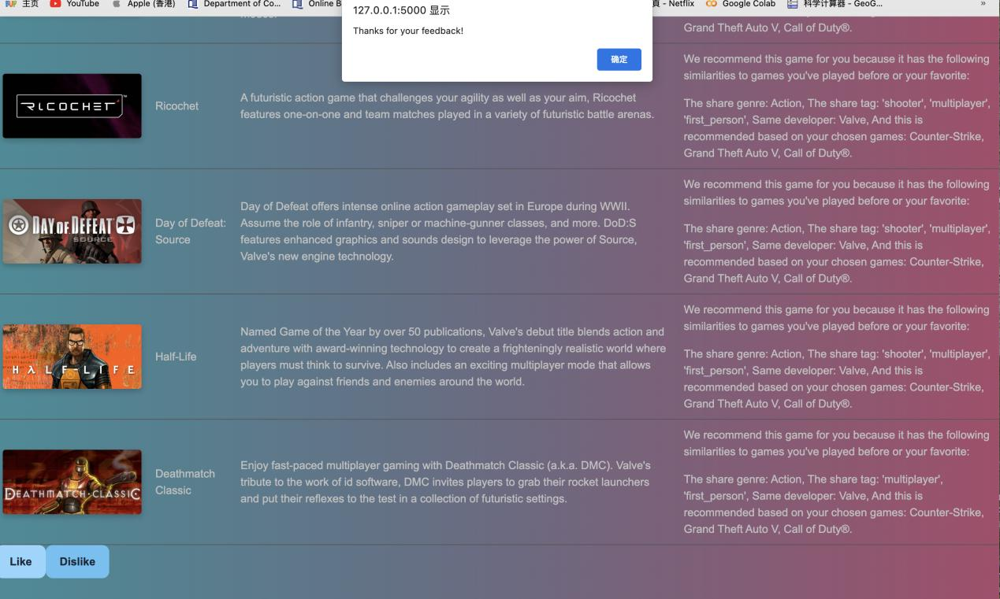

# Too Young Too Simple - Game Recommendation System

## Introduction
The game industry has experienced significant growth in recent years, leading to a vast number of game options. However, this abundance of choices makes it difficult for players to find games that match their preferences. Platforms like Steam and Epic Games primarily focus on providing downloads with limited recommendation features.

To address this challenge, our team has developed **Too Young Too Simple**, a game recommendation system that employs a **hybrid recommendation algorithm**. This system aims to offer **personalized** game recommendations to users based on their preferences.

## Features
Our system provides the following core functionalities:

- **User Authentication**: Users can sign up, log in, and manage their profiles.
- **Game Selection**: Users can input three games they have played or liked.
- **Hybrid Recommendation Algorithm**: The system recommends five new games based on a mix of content-based filtering and rating-based weighting.
- **Feedback Mechanism**: Users can "Like" or "Dislike" recommendations to refine future suggestions.
- **Responsive UI**: A simple, user-friendly interface for seamless navigation.

## System Workflow
1. **User Registration & Login**: Users can create an account or log in to access the recommendation features.
2. **Game Selection**: Users select three games from a **drop-down menu** or **search bar**.
3. **Game Recommendation**: The system analyzes **game descriptions, Steam tags, and popularity** to generate recommendations.
4. **Feedback Mechanism**: Users can provide feedback via "Like" or "Dislike" buttons:
   - "Like": Displays a confirmation message.
   - "Dislike": Generates five new recommendations.
5. **User Profile & About Page**: Displays user details and team contact information.

## Hybrid Recommendation Algorithm
Our system combines **content-based filtering** with **rating-based weighting** to generate accurate and personalized recommendations:

- **Content-Based Filtering**: Uses **TF-IDF** (Term Frequency-Inverse Document Frequency) to analyze game descriptions, tags, and categories.
- **Rating-Based Weighting**: Considers **normalized positive ratings** to prioritize more popular games.
- **Final Ranking**: Weights both components (e.g., **60% content similarity + 40% rating**) to provide well-balanced recommendations.

### Performance Evaluation
We compared our hybrid recommendation system with two non-hybrid models (A and B) using **Root Mean Squared Error (RMSE)** analysis. Results showed that our approach provides significantly better recommendations.

## System Screenshots
### **Login Page**

### **Sign-Up Page**

### **Main Page - Game Selection**

### **Game Recommendations**

### **Feedback Mechanism**
- **Like Button**
  
- **Dislike Button (New Recommendations)**
  

### **About Page**

## Future Improvements
- **Collaborative Filtering**: Incorporate user ratings to enhance recommendation accuracy.
- **Deep Learning Models**: Experiment with neural networks for improved predictions.
- **UI Optimization**: Improve design and usability for better user experience.
- **Expanded Data Sources**: Integrate real-time game data for more dynamic recommendations.

## Team Members
- **Liao Yijie** - System design, front-end development, back-end implementation, algorithm development.
- **Shao Zixuan** - Data processing, algorithm development, evaluation.

For inquiries, contact us at:
📧 **20250576@life.hkbu.edu.hk**

## References
- Kaggle Steam Store Dataset: [Steam Games Dataset](https://www.kaggle.com/datasets/nikdavis/steam-store-games?select=steam.csv)
- Flask: [Flask Documentation](https://flask.palletsprojects.com/)
- NumPy: [NumPy](https://numpy.org/)
- scikit-learn: [scikit-learn](https://scikit-learn.org/stable/)
- Pandas: [Pandas](https://pandas.pydata.org/)
- Plotly: [Plotly](https://plotly.com/python/)
- Surprise Library (Recommender Systems): [Surprise](http://surpriselib.com/)

---
